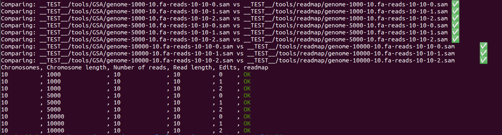

[](https://classroom.github.com/online_ide?assignment_repo_id=9454883&assignment_repo_type=AssignmentRepo)
# Project 5: building your very own readmapper

In this final project, you will write a complete read mapper.

The read mapper should be able to preprocess a reference genome. To avoid preprocessing each time you need to map reads, you should store the preprocessed data structures on disk. Reference genomes come in Simple-FASTA format, as usual, and reads in Simple-FASTQ format, and your tool must write matches to standard out in Simple-SAM.

Your program, which should be named `readmap`, and should take the following options:

* `readmap -p genome.fa` should preprocess the genome
* `readmap -d k genome.fa reads.fq` should do read-mapping for matches within an edit distance .


## Assembly required

If you have made all project and all exercises you will have most of what goes into a readmapper.

1. You implemented the file format parsers in the first week of the class, and you have been using them in the four previous projects.
2. If you map using a suffix tree, you have implemented it in project 2.
3. If you map using Li & Durbin’s algorithm you implemented most of the necessary data structures in projects 3 and 4.

## Batteries not included

You have not implemented approximative matching, so you have to implement that now.

## Testing

You can use the [gsa] Python package for generating test data and running tests. You can clone it from the GitHub repository or use:

```bash
> python3 -m pip install git+https://github.com/birc-gsa/gsa#egg=gsa
```

Amongst other things, the tool can simulate data. If you run, for example

```bash
> gsa simulate genome 23 100000 > genome.fa
```

you will simulate a genome with 23 chromosomes, each of length 100,000.

After that,

```bash
> gsa simulate reads genome.fa 2000 100
```

will simulate 2000 reads of length 100.

If you then do

```bash
> gsa search genome.fa reads.fq approx -e 1 bwt
```

to find all the hits within one edit distance of a read. If you want it faster, preprocess the genome first with

```bash
> gsa preprocess genome.fa approx-bwt
```

You should notice a speed difference; you want to achieve the same with your own preprocessing.

You can use the tool to test your read mapper as well. This requires a spec file that defines how tools should be tested. It can look like this:

```yaml
tools:
  GSA:
    preprocess: "gsa preprocess {genome} approx-bwt"
    map: "gsa search {genome} {reads} -o {outfile} approx -e {e} bwt"
  readmap:
    preprocess: "{root}/readmap -p {genome}"
    map: "{root}/readmap -d {e} {genome} {reads} > {outfile}"

reference-tool: GSA

genomes:
  length: [1000, 5000, 10000]
  chromosomes: 10

reads:
  number: 10
  length: 10
  edits: [0, 1, 2]
```

The `tools` section is a list of tools to run, each with a `preprocess` and a `map` command line. You can have as many as you like. The `reference-tool` selects which tool to consider “correct”; all other tools are compared against its results. Then `genomes` specify the genome length and number of chromosomes. Lists here will add a test for each combination. Similarly, the `reads` specify the reads, their number and length and how many edits the simulation and the readmapping will use.

The variables in `{...}` are used by `gsa` when you specify command lines. `{root}` refers to the directory where the YAML file sits, so if your tool and the YAML file are in the same directory, your tool is at `{root}/readmap`. The `{genome}` and `{reads}` tags are the input files and `{outfile}` the name of the output file. Don’t get inventive with the command line for your tool, though, I also have a test ready to run, and if you do not implement the interface specified above, the test will fail (and that will be your problem and not mine).

If you put this file in `tests.yml`, and you have the tool `readmap`, you can run the test with

```bash
> gsa -v test tests.yaml
```

The read mapper in `gsa` doesn’t output matches with leading or training deletions. We talk about why, and how you avoid it as well, in the exercises. Keep that in mind when you are developing your own tool.

## Evaluation

Once you have implemented the `readmap` program (and tested it to the best of your abilities) fill out the report below, and notify me that your pull request is ready for review.

# Report

## Algorithm

*Which algorithm did you use for read mapping?*
For read mapping we implemented the bwt using fm-search and the D-table.

## Insights you may have had while implementing the algorithm


## Problems encountered if any
When computing the approximate matches we don't reset L, R when a mismatch occurs (as we do when calculating the D table). Instead we need add an element to our queue for every letter of our alphabet (apart from the matching one and the sentinal) and search further down from there.
We had to run the tests on a Linux terminal.

## Validation
We compared the output of our algorithm against the output from the [gsa] Python package in the tests.yaml file.
The tests worked.


## Running time
For implementing the approximate search we used the BWT approach with the D table. 
We used our implementation from project 4 to preprocess the sequence. Therefore, we calulate the SA/reversed SA in O(n log n), the O and reversed O table and the C table. To calculate the C and O table we first had to calculate the BWT in O(n) for the string/reversed string. Then we construct the C table in O(n), we only need to construct it once because it is the same for the string and the reversed string.
Having bwt/reversed bwt and C we finally construct the O table/reversed O table in O(n*$\sigma$).

After processing the string we now want to start the approximate matching.
For the approximate-fm-search we first construct the D-table of the pattern, which uses the reversed O and C table and runs trough the pattern ones O(m). The table gives a minimum number of edits you need to match the rest of the pattern and therefore works like a filter. 
Having the D-table we now run approximate_fm_search(). Here we work with a queue and "walk trough our pattern". In every step we add (if possible) a match, $\sigma$-1 mismatches, $\sigma$ delitions and a insertion to th

The first two plots show that pattern length only has a constant effect on the running time:

<<<<<<< HEAD
## Random:


## Single-symbol string:


The preprocessing algorithm includes creating the suffix array for which we use Python's sorted() 
The fm-search runs in O(m), because we loop trough the pattern string of size m -> O(m) and for every letter we get "Rank" and "Select" by indexing into O and C -> O(1).

The following figures show that all of the algorithms look like they would run in linear time for x = a^n and a random sequence. This would be is suprising for the cration of the SA, but also it is very diffiult to distinguisch between O(n) and O(n log(n)) by looking at the graphs. The preprocessing in total (orange) takes longer because it also includes the creation of bwt and the tables. 
Finally, the fm search uses the preprocessed tables and array (that it needs to load) and then represents the search time through the pattern. 

## Random:


## Single-symbol string:

=======
The second 
*List experiments and results that illustrates the running time. Add figures by embedding them here, as you learned how to do in project 1.*
>>>>>>> 1c8d88870d5f4b1a97607656a296cebdc90f5e29
